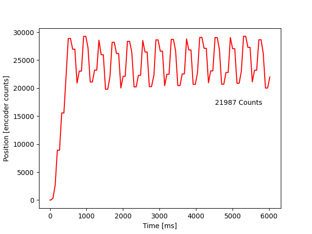
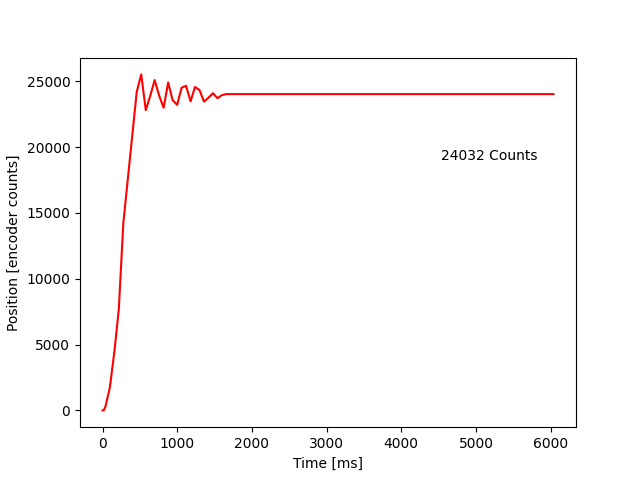
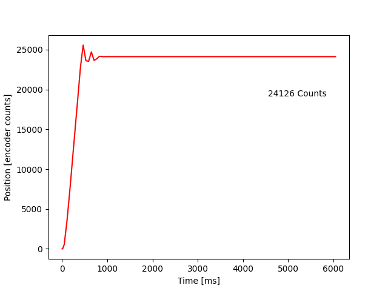
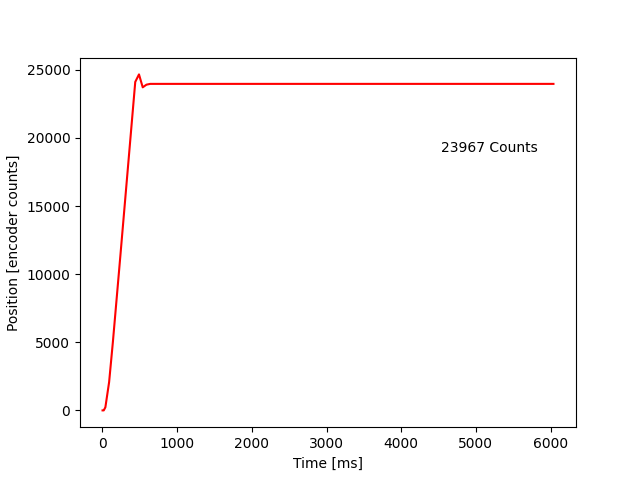

# Lab 3: Task Scheduling of Motor Controllers

In this lab, we use what we learned from the last lab in controlling motors, and we implament that into a task scheduler.
We first made a motor task which handles all of the control of the motor, which moves the motor to the position described
by the position share for the corresponding motor. Then we made a task for performing a step response, which shares the 
desired position, and receives position data to then output the response plot over a serial port to another computer.

The motor task utilizes the three classes we developed/used last lab, those being the motor driver, encoder driver, and
the motor controller. The method, update(), of the motor task handled all the updating of the encoder, which passes
position of the system to the controller, and then updates the motor with the output desired duty cycle of the controller.

The step response task handles performing the step response and supplying each motor with a set point through a share. 
Then, once the step response is done, it passes the data through the serial port of the ST-Link to another computer to 
be processed into a plot.

In order to test the desired scheduling cycle period for the motor task, we tried different cycle periods, which the
results are displayed below.

The first plot shows the worst performance we tried. The task call rate was set to 100ms period. This caused excessive
oscillation as the system could not update quick enough to converge on the setpoint.

We can produce a better system reaction by lowering the period of time it takes to call the task again. Lowering the
period to 50ms does not procude ideal behavior, but it begins to converge on the setpoint.

Lowering it further, we produce the a better response. There is still non-ideal oscillation.

Dropping all the way down to 10ms period, we produce the most ideal behavior. There is still some overshoot from the
proportional controller being non-ideal, however, this is the best performance we can achieve at a reasonable update rate.

